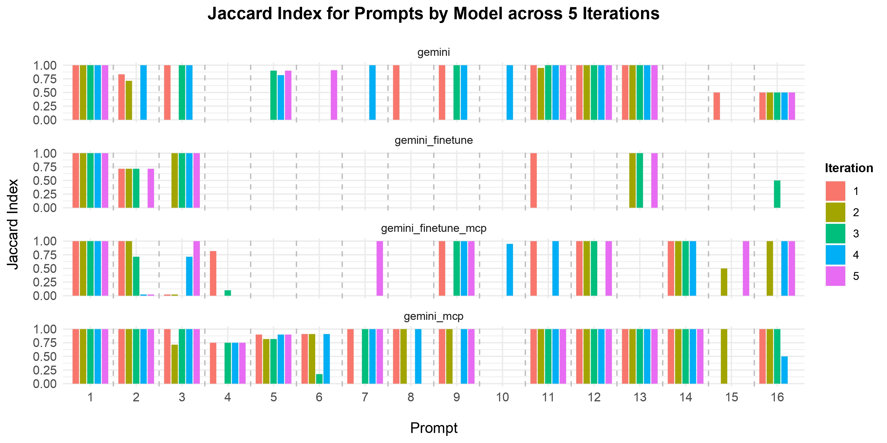

# Raw grading Results
This json includes the scores (average precision, average recall, F1 micro and macro, global and average Jaccard index) the models were able to reach in each of the 5 iterations:
```json
{'gemini': {'precision': [0.6145833333333334, 0.35401785714285716, 0.5, 0.68125, 0.4318181818181818], 'recall': [0.5625, 0.34375, 0.4625, 0.65, 0.4], 'f1_macro': [0.5776515151515151, 0.3421474358974359, 0.4758771929824562, 0.6604166666666667, 0.4104010025062657], 'f1_micro': [0.7325581395348837, 0.578616352201258, 0.6351931330472104, 0.9348914858096828, 0.5197215777262181], 'global_jaccard_index': [0.5779816513761468, 0.40707964601769914, 0.46540880503144655, 0.877742946708464, 0.3510971786833856], 'average_jaccard_index': [0.5520833333333334, 0.32276785714285716, 0.4625, 0.6448863636363636, 0.3943181818181818]}, 'gemini_finetune': {'precision': [0.16964285714285715, 0.23214285714285715, 0.29464285714285715, 0.125, 0.23214285714285715], 'recall': [0.1875, 0.25, 0.28125, 0.125, 0.25], 'f1_macro': [0.17708333333333331, 0.23958333333333331, 0.28125, 0.125, 0.23958333333333331], 'f1_micro': [0.5327510917030568, 0.5066666666666666, 0.5198237885462554, 0.3394255874673629, 0.5066666666666666], 'global_jaccard_index': [0.3630952380952381, 0.3392857142857143, 0.35119047619047616, 0.20440251572327045, 0.3392857142857143], 'average_jaccard_index': [0.16964285714285715, 0.23214285714285715, 0.26339285714285715, 0.125, 0.23214285714285715]}, 'gemini_finetune_mcp': {'precision': [0.49375, 0.4375, 0.35714285714285715, 0.47901785714285716, 0.5], 'recall': [0.4326388888888889, 0.3451388888888889, 0.31875, 0.4388888888888889, 0.4388888888888889], 'f1_macro': [0.4339673913043478, 0.3568840579710145, 0.3134469696969697, 0.42819816053511706, 0.44021739130434784], 'f1_micro': [0.625, 0.4411764705882353, 0.3770883054892601, 0.725563909774436, 0.55125284738041], 'global_jaccard_index': [0.45454545454545453, 0.2830188679245283, 0.2323529411764706, 0.5693215339233039, 0.3805031446540881], 'average_jaccard_index': [0.42752525252525253, 0.3451388888888889, 0.3008928571428572, 0.41790674603174605, 0.4388888888888889]}, 'gemini_mcp': {'precision': [0.8579545454545454, 0.7827110389610389, 0.6808512759170654, 0.8267045454545454, 0.6761363636363636], 'recall': [0.8625, 0.80625, 0.7375, 0.8625, 0.675], 'f1_macro': [0.8598057644110275, 0.7928571428571428, 0.6909781449893391, 0.8389724310776941, 0.675281954887218], 'f1_micro': [0.8776223776223777, 0.7885304659498207, 0.807131280388979, 0.8655172413793104, 0.8405797101449275], 'global_jaccard_index': [0.7819314641744548, 0.650887573964497, 0.6766304347826086, 0.7629179331306991, 0.725], 'average_jaccard_index': [0.8474431818181818, 0.7775974025974025, 0.6714762759170654, 0.8161931818181818, 0.665625]}}
```
From this can be calculated what models are statistically significantly better (p < 0.5) than other models, for each score:
```
Precision:
gemini is significantly better than gemini_finetune (p-value: 0.0039)
gemini_mcp is significantly better than gemini (p-value: 0.0101)
gemini_finetune_mcp is significantly better than gemini_finetune (p-value: 0.0003)
gemini_mcp is significantly better than gemini_finetune (p-value: 0.0000)
gemini_mcp is significantly better than gemini_finetune_mcp (p-value: 0.0002)

Recall:
gemini is significantly better than gemini_finetune (p-value: 0.0053)
gemini_mcp is significantly better than gemini (p-value: 0.0025)
gemini_finetune_mcp is significantly better than gemini_finetune (p-value: 0.0018)
gemini_mcp is significantly better than gemini_finetune (p-value: 0.0000)
gemini_mcp is significantly better than gemini_finetune_mcp (p-value: 0.0000)

F1 macro:
gemini is significantly better than gemini_finetune (p-value: 0.0048)
gemini_mcp is significantly better than gemini (p-value: 0.0048)
gemini_finetune_mcp is significantly better than gemini_finetune (p-value: 0.0013)
gemini_mcp is significantly better than gemini_finetune (p-value: 0.0000)
gemini_mcp is significantly better than gemini_finetune_mcp (p-value: 0.0001)

F1 micro:
gemini_mcp is significantly better than gemini_finetune (p-value: 0.0001)
gemini_mcp is significantly better than gemini_finetune_mcp (p-value: 0.0078)

Global Jaccard Index:
gemini_mcp is significantly better than gemini_finetune (p-value: 0.0000)
gemini_mcp is significantly better than gemini_finetune_mcp (p-value: 0.0030)

Average Jaccard Index:
gemini is significantly better than gemini_finetune (p-value: 0.0059)
gemini_mcp is significantly better than gemini (p-value: 0.0046)
gemini_finetune_mcp is significantly better than gemini_finetune (p-value: 0.0011)
gemini_mcp is significantly better than gemini_finetune (p-value: 0.0000)
gemini_mcp is significantly better than gemini_finetune_mcp (p-value: 0.0001)
```
This shows that Gemini (MCP) is better than all other models in both important metrics for this grading (Average Jaccard & F1 macro) with p < 0.005, which is far lower than the usual p < 0.5 threshhold for statistical significance.



# Code

Interesting **Frontend** code is in [`App.tsx`](frontend/src/App.tsx).

Interesting **Backend** code can be found in:
* [`backend/server.py`](backend/server.py)
* [`backend/gemini.py`](backend/gemini.py)
* [`backend/gemini_mcp.py`](backend/gemini_mcp.py)

The **Evaluation** code used to generate and grade the results can be found in:
* [`evaluation/promptModel.py`](evaluation/promptModel.py)
* [`evaluation/grading.py`](evaluation/grading.py)

The web app is currently being hosted on [Wikiquery.org](https://www.wikiquery.org)

# Running the code yourself
__Prerequisites__

You will need your own Google API keys, since we cannot publish ours to Gihub due to scrapers. For a key to the finetuned model, just write us a mail. To use your own key for plain gemini, replace the 'REPLACE THIS' text in gemini.py with your key. For your own vertex API model, do the same with the credentials.json file (either in [`backend/credentials.json`](backend/credentials.json) or in [`credentials.json`](credentials.json), as different python interpreters handle relative paths differently. For us, hosting with the built-in flask server required one location, while the gunicorn server required the other).

__Frontend:__

Make sure you have `npm` installed, then head to [`frontend`](frontend/).
Install:
```bash
npm install
```
After installing, it can be run with:
```bash
npm run dev
```
__Backend:__

Make sure you have `python3` installed (including `pip`), then head to [`backend`](backend/).
```bash
pip install -r requirements.txt
```
After installing, it can be run with:
```bash
python3 server.py
```
For deployment in production, a proper wsgi server like [gunicorn](https://gunicorn.org/) is strongly recommended.
